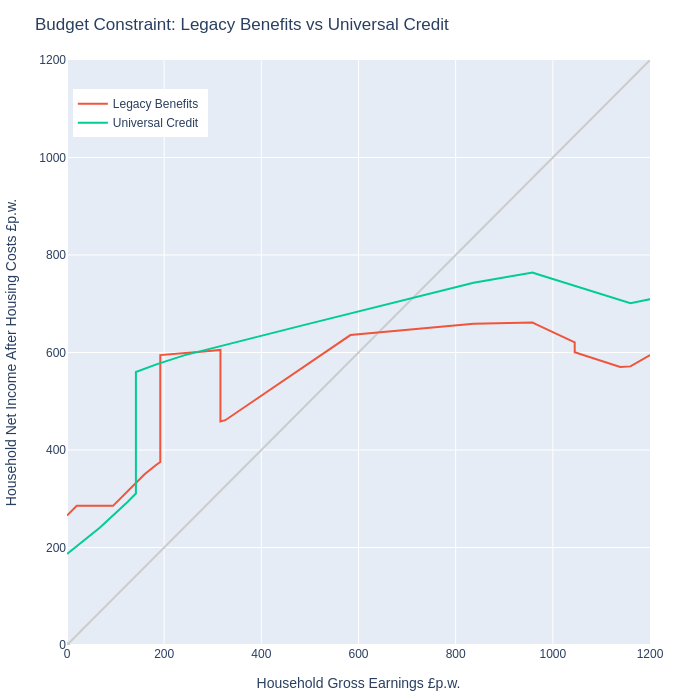

# The Legacy to UC Transition

We're in the middle of the move from the Legacy Benefit to Universal Credit transition.

This [keeps being delayed](https://www.bbc.co.uk/news/uk-51318730), of course, but the transition is around 60% complete. 

The best source of disaggregated information on this is the [House of Commons Library](https://commonslibrary.parliament.uk/constituency-data-universal-credit-roll-out/#caseload). They do painstaking disaggregation of the transition using information from [Stat-Xplore](https://stat-xplore.dwp.gov.uk/webapi/jsf/login.xhtml) and the [HMRC Tax Credit Statistics](https://www.gov.uk/government/collections/personal-tax-credits-statistics). But reasonably enough they break down by parliamentary constituency rather than local authority, which is all the infomation I have (and that only kinda-sorta). I can see what they're doing and am tempted to have a bash at an LA level decomposition; it would be a public service but I just don't have the time and it's a messy calculation. So the model uses Scotland-level averages.

It's evident that the DWP have gone for the easy ones first:

Proportion of benefit recipients transitioned to UC, September 2021

|-------------------|-------------------|
|    Overall      | 0.59 | 
|    With Housing Costs    | 0.61 |
|    Households With Children     | 0.55 |
|    Incapactity | 0.32 |
|    Job Seekers | 0.95 |

Source [House of Commons Library](https://commonslibrary.parliament.uk/constituency-data-universal-credit-roll-out/#caseload)

Since clearly a benefit unit (or household? it's not always clear) can be be seeking a job, and have children, a disability, and so, it's not absolutely clear how to apply this to a micro dataset, but the module [UCTransition.jl](https://github.com/grahamstark/ScottishTaxBenefitModel.jl/blob/master/src/UCTransition.jl) is my best effort.

# Scottish Disability Benefits

A series of new [Scottish disability benefits](https://www.gov.scot/policies/social-security/benefits-disabled-people-ill-health/) are [moving towards implementation](). 

Kind of the point of this model is to capture changes like this. 

These are tricky to model. The [Social Security Scotland documents](https://www.gov.scot/publications/consultation-adult-disability-payment/) stay that the initial intention is that the new benefits mirror exactly the entitlements to DLA, PIP and Attendance Allowance that they replace, but with less intrusive examinations. So in principle, from our high level, we can just relabel existing DLA/Pip receipts and we're done. But the [Scottish Fiscal Commission think the new benefits will end up being more generous](https://www.fiscalcommission.scot/publications/how-we-forecast-social-security-disability-and-carers-payments-may-2021/). We'll just have to see, but clearly we need some modelling of the generosity of the disability tests. This is hard-ish because, although the FRS has a series of disability questions, they don't follow the [ones used in current tests](https://www.gov.uk/government/publications/personal-independence-payment-fact-sheets/pip-handbook#assessment-criteria), and likely not the evential SBA tests. In the event, I've just [run some Probits](https://github.com/grahamstark/ScottishTaxBenefitModel.jl/tree/master/regressions) on FRS recorded DLA/PIP/AA receipt against the FRS disability indicators and a few other demographics. 

The module [BenefitGenerosity.jl](https://github.com/grahamstark/ScottishTaxBenefitModel.jl/blob/master/src/BenefitGenerosity.jl) uses these probits to adjust disability benefit receipt up and down depending on some user supplied estimate of total extra numbers entitled. This seems to be [the same in spirit to how the SFC models this](https://www.fiscalcommission.scot/publications/how-we-forecast-social-security-disability-and-carers-payments-may-2021/). To minimise disruption to the data, instead of basing all entitlements on the highest modelled receipt probabilities from the probits, we instead construct a list of most current non-recipients with highest probabilities, and add those when making the benefits more generous, and likewise a list of the current recipients with the lowest probabilities, and remove those if the tests are modelled as more severe. I'm sure a proper statistician would find lots to fault here, but it seems the procedure that captures what we want whilst distrupting the data least.

# Testing, Testing 

The model now has a [huge test suite](https://github.com/grahamstark/ScottishTaxBenefitModel.jl/tree/master/test), all of which passes, but I worry about test coverage still. 

The lack of worked examples of benefit calculations in either the [CPAG Guides](https://cpag.org.uk/shop/cpag-titles/welfare-benefits-tax-credits-handbook-202122) or the online guides from [the Government], [Shelter](https://scotland.shelter.org.uk/), [Age UK](https://www.ageuk.org.uk/information-advice/money-legal/benefits-entitlements/) and the rest is a real problem. I'n guessing the incentive here is to upsell training courses with this stuff.

Instead, I've been testing against an [online calculator](cbenefit-budgeting-calculator/) from [Policy in Practice](https://policyinpractice.co.uk/benefit-budgeting-calculator/). As someone who [used to write this sort of thing](https://www.virtual-worlds.scot/demonstrations/), I have to say the PiP calculator is really very well designed and easy to use. 

It's a slightly frustrating task as I really need the whole model completed before I could launch in to this testing, rather than test-as-you-write, which I'd prefer. And there are some minor niggles that needed sorting out, like how many weeks are there in a year (not as obvious as you might think)? But testing against PiP was a really productive experience, at first turning up some really embarrassing errors I'd made, and then eventually getting to the point where I felt I was slightly ahead of them (my income tax calculations are a bit more complete in obscure corner cases, for instance).

I still don't think there are enough tests though. For instance, my [inequality routines](https://github.com/grahamstark/PovertyAndInequalityMeasures.jl) broke badly when confronted by real data with negative incomes in it, despite passing a pretty large test suite based on worked examples from [the World Bank](http://documents.worldbank.org/curated/en/488081468157174849/Handbook-on-poverty-and-inequality) (a few of the the world bank ones were wrong, incidentally).

One very good testing technique for a model like this is to drive a [budget constraint generator](https://github.com/grahamstark/BudgetConstraints.jl) through it and see if the results can be rationalised - the generator homes right in on all the wierd stuff - net incomes that drop off a cliff with small increments to wages, marginal tax rates over 100 or less than zero. [Scotben is now doing very well there](https://stb.virtual-worlds.scot/bcd/), at least to the extent that I understand how all the interactions are supposed to work. I'll write about that next.

On the process of testing, I've been reading the [Google Testing on the Toilet Door Series](https://testing.googleblog.com/2007/01/introducing-testing-on-toilet.html) - recommended. My test suite would not do well against Google's principles but it's the best I can do on my own to this timescale.

# Scotland's Kinkiest Families

I've finally put [some of this model out into the world](https://stb.virtual-worlds.scot/bcd/) - to almost zero response so far, but that's OK.

This was originally just a testing exercise. The [Budget Constraint generator](https://github.com/grahamstark/BudgetConstraints.jl) has always been a great way of ferreting out all the weirdness in a model: it finds all the discontinuities, marginal effective tax rates (METRs) that go the 'wrong' way.

Like this one:

This shows the gross/net income relationship for a family with 7 children and £270pw in housing costs, living in a council house. So a pretty unusual family, but still.. Both the legacy system (red) and UC (greeen) are shown.

There's a lot going on here. Key things are:

* [Benefit Cap](https://www.gov.uk/benefit-cap). This limits the amount of  benefits received, but only for Working Tax Credit recipients (Legacy) and only for those earning below £617pm (UC). Hence the big jumps upward at the points where the family qualifies for WTC or earns £617, and back down in the Legacy case when WTC entitlement is exausted. The downward sections on the right are a combination of child benefit withdrawal over £50,000 per year (50%), higher rate income tax, and UC/WTC withdrawal (these can go surprisingly high up for large families). There are other weird ones, too, like the interaction between the Discresionary Housing Payments the Scottish government use to [ameliorate the Bedroom Tax](https://www.gov.scot/policies/social-security/support-with-housing-costs/) and the benefit cap - these combined can produce *negative* marginal tax rates.

# User Interfaces

# Up and Running at last

